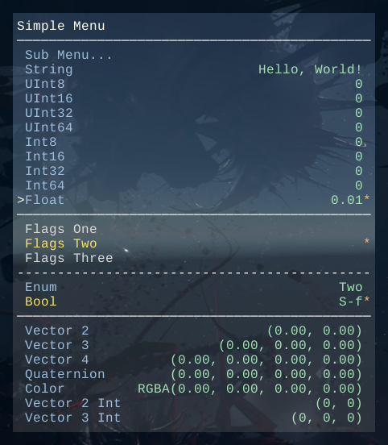
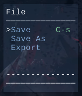

# XiKeyboard Manager for Unity 3D

The asset for Unity 3D with keyboard manager similar to Emacs  created by [hww](https://github.com/hww)


[](https://github.com/hww/XiKeyboard/actions/workflows/ci.yml)
[](https://openupm.com/packages/com.hww.xikeyboard/)
[](https://github.com/hww/XiKeyboard/blob/master/LICENSE)
[](https://github.com/semantic-release/semantic-release)

## Status

<sup>Basic functionality works but still there are things todo</sup> 

- [x] Keyboard and Shortcuts System
- [x] Simple and complex menu lines
- [x] The menu separator: space, line, dashed
- [x] Keystroke binding
- [x] Menu system: open, close, toggle, submbenu 
- [x] Basic integer and float types support 
- [x] Enum and the enum flags support
- [ ] Vector3 and other vector classes 
- [ ] Update documentation

## Introduction

This package provides a handy API which allows you to easily create handlers for keyboard sequences. For example the sequence <control>+<c> followed by <control>+<x> can be specified by the string "C-c C-x". The main purpose of the package is as a debugging tool for game developers. After all, it is desirable for a game developer to have a dozen or more different functions quickly available -- on the keyboard. For the target platform the library can be used but probably only on a platform with a keyboard. The XiKeyboard is integrated with simple in game debugging menu.



## Alternative

This keyboard and menu system has designed for functionality and better keyboard support. It is better to use for complex projects with hundreds of shortcuts.

The other alternative is my simple menu [XiDebugMenu](https://github.com/hww/XiDebugMenu) designed for simplicity and low memory footprint.

If you need more than _XiDebugMenu_ but less than _XiKeyboard_ then consider to use the advanced version [extDebug](https://github.com/Iam1337/extDebug). It has much ballanced number of features and I believe you will have a professional support from autor [Iam1337](https://github.com/Iam1337).
	
## Terms

There are sevaral terms you should know before undertand this document

- *Keyboard vs Menu* The big thing is: the keyboard and menu systems are combined in the Emacs
- *Key modifier* The bitfield with keep the state of special keys: shift, control, alt, etc
- *Pseudo key* The single bit, modifier which is signaling the virtual key. Used for the menu system
- *Event* The data container. Holds the keycode and key modifier
- *Key sequence* Is the sequance of events
- *Key map* The table which convert the event to the binding -- a delegate or an other key map. The maps organized as three and there is a global map at the top.
- *Mode* The data containter with name and a key map
- *Buffer* The data container, the event's aray where will be acumulated the events -- the keys pressed by a user. The buffer could have one major and multiple minor modes. 
	
Could be created multiple buffers, but only one buffer receiving inputs -- current buffer. The image below has a _buffer2_ as current buffer and _mode1_ as the major mode.
	


## Installing

The package is available on the openupm registry. You can install it via openupm-cli.

```bash
openupm add com.hww.xikeyboard
```
You can also install via git url by adding this entry in your manifest.json

```bash
"com.hww.xikeyboard": "https://github.com/hww/XiKeyboard.git#upm"
```

## Usage
	
The example below shows how the API can be used to define key sequences. Each key press will print current buffer to log. And in case of two sequences will be printed "Pressed Sequence: N" text (where N is 1 or 2)

```C#
void Start ()
{
	KeyMap.GlobalKeymap.Define("S-1", "Pressed: S-1");         // Define keystroke S-1 with text binding "1"
	KeyMap.GlobalKeymap.Define("S-2 S-3", "Pressed: S-2 S-3"); // Define keystroke S-2 S-3 with text binding "2"
	Buffer.OnSequencePressed.Add(OnSequencePressed);           // On press sequence delegate
	Buffer.OnKeyPressed.Add(OnKeyPressed);                     // On press key delegate
}
void OnSequencePressed(Buffer buffer, KeyMapItem item) {
	Debug.Log("{" + item.value + "}");	      // Print "Pressed Sequence: N" 	
}
void OnKeyPressed(Buffer buffer, Event evt) {
	Debug.Log(buffer.GetBufferHumanizedString()); // Just display current buffer content		
}
void OnGUI()
{
        InputManager.OnGUI(); // Execute the input manager will send key press to the XiKeyboard
}
 ```

Can be binded any value, for example: GameObject, lambda function or menu item. 
The pressing the sequence: "abcS-1defS-2S-3" will print log below. The S-1, S-2 and S-3 are Shift+1, Shift+2 and Shift+3.

```
a
ab
abc
abcS-1
{Pressed: S-1}
abcS-1d
abcS-1de
abcS-1def
abcS-1defS-2
abcS-1defS-2S3
{Pressed: S-2 S-3}
```


## Key Modifiers

Key modifiers encoded as most significant bits of integer value. The virtual key _Pseudo_ used to generate pseudo keys<sup>Read Below</sup>.

| Modifier                 | Bit         | 
|--------------------------|-------------|
| KeyModifyers.MaxCode     | 1 << 28 - 1 |
| KeyModifyers.Meta        | 1 << 27     |
| KeyModifyers.Control     | 1 << 26     |
| KeyModifyers.Shift       | 1 << 25     |
| KeyModifyers.Hyper       | 1 << 24     |
| KeyModifyers.Super       | 1 << 23     |
| KeyModifyers.Alt         | 1 << 22     |
| KeyModifyers.Pseudo      | 1 << 21     |

## Event

The key Event is container with key code and key modifier. For every pressed key will the key code will be packed with modifier to Event and submit to current input buffer<sup>Read Below</sup>. 

To create new event there is _MakeEvent_ method.

```C#
var event = Event.MakeEvent(KeyCode.A, KeyModifyers.Shift);      // Makes S-a event
```

To check event's modifiers there is _IsModifyer_ method.

```C# 
event.IsModifyer(event, KeyModifyers.Shift);                     // Return true
event.IsModifyer(event, KeyModifyers.Control);                   // Return false
```

Other methods of Event you can see below.

```C#
var name = event.Name;                                           // Return S-a
var valid = event.IsValid;                                       // Return true if the keycode is valid
var keyCode = event.KeyCode;                                     // Return KeyCode.A as integer
var keyModf = event.Modifyers;                                   // Return KeyModifyers.Shift
```

## Pseudo Keys

The pseudo codes are virtual keys with unique names. Each pseudocode has a key modifier _Pseudo_ is in pressed state. 

```C#
var pseudo = Event.GetPseudocode("Foo");       // Get random pseudo code with unique name "Foo"
var default = Event.DefaultPseudoCode;         // Get default pseudo code. It has name "default"
```

## Humanized Key Name

The key code can be converted to humanize name, or reversed. To define the name use method _SetName_

```C#
Event.SetName((int)KeyCode.RightCommand, "\\c-");
var name = Event.GetName((int)KeyCode.RightCommand);  // Return "\\c-"
```

## Key Sequence

The sequence can be defined as array of events. The example below defines the sequence "C-x C-f"

```C#
Event[] sequence = new Event[2] { 
    Event.MakeEvent((int)KeyCode.X, KeyModifyers.Control), 
    Event.MakeEvent((int)KeyCode.F, KeyModifyers.Control) 
    };
```

Alternative way is parsing the expression <sup>similar to Emacs</sup>.

```C#
var sequence = Kbd.ParseExpression("C-x C-f");
```

## Key Map

There are two variants of constructor available. One for the ordinary key-map and another for child key map. When called LookUp method of key-map, and in case if key binding not found, and default binding is not alowed, will be called LookUp method of parent key map. The default binding is the field of each key map, used only when allowed by dedicated argument.

```C#
KeyMap(string title = null, string help = null )
KeyMap(KeyMap parent, string title = null, string help = null )
```

#### Key Map Item

This object link a key event with other item: 

- other keymap
- sequence binding
- menu item
- lambda function
- anything else... 
 
KeyMapItem contains the next fields.

| Field         | Info         |
|---------------|--------------|
| int key       | Key event    |
| object value  | Binded value |

The constructor requires those two fields as arguments.

```C#
KeyMapItem(int key, object value)
```

#### Define Local Binding

To define and read local binding means does not look at parent key map.

```C#
var event = Event.MakeEvent((int)KeyCode.A, KeyModifyers.Shift); // Makes S-a event
keyMap.SetLocal(event, "Foo");                                   // Bind to S-a event of this key map the string "Foo"
var binding = keyMap.GetLocal(event, false);                     // Second argument accept default binding.
```
#### Define Global Binding

The define binding to the sequence use _Define_ method, use event sequence and object to bind as arguments.

```C#
Define(int[] sequence, object value);
Define(string expression, object value);
``` 

Alternative version of this method dedicated for menu definition, and will use pseudo codes for this binding.

```C#
Define(string[] sequence, object value)
```

For example lets define menu _File_ and option _Save_ and bind to it a menu item.<sup>Read Menu chapter</sup>

```C#
Define(new string[]{"File", "Save"}, menuItem )
```

#### Lookup Binding

To lockup biding in hierarchy use _LokupKey_ method.

```C#
KeyMapItem LokupKey(int[] sequence, bool acceptDefaults = false)
```

Additionaly there is version of this method with start and end index in the sequence aray.

```
KeyMapItem LokupKey(int[] sequence, int starts, int ends, bool acceptDefaults = false)
```

## Global Key Map

The default global key map, can be used in most cases without creating additional key-maps.

```C#
var globalKeyMap = KeyMap.GlobalKeymap;
```

## Full Keymap

If an element of a key map is a char-table, it counts as holding bindings for all character events with no modifier element n is the binding for the character with code n. This is a compact way to record lots of bindings. A key map with such a char-table is called a full key-map. Other key-maps are called sparse key-maps.

#### Sequence Binding

This is simple keysequence binding to any key. The pressing this key will invoke this sequence.

| Field          | Info             |
|----------------|------------------|
| string name    | Binding's name   |
| string help    | Binding's help   |
| int[] sequence | The key sequence |

The constructor for sequence requires two fields values.

```C#
SequenceBinding(string name, int[] sequence, string help = null)
```


## Mode

To create new mode use constructors.

```C#
// Create new mode with name, help and given key map
public Mode(string name, string help = null, KeyMap keyMap = null)
// Create new child mode with name, help and given key map 
public Mode(Mode parentMode, string name, string help = null, KeyMap keyMap = null)
```

To read name and help

```C#
Debug.Log(mode.name);
Debug.Log(mode.help);
```

To add remove listeners use delegates  _OnEnableListeners_ and _OnDisableListeners_.

```C#
mode.OnEnableListeners += () => { Debug.Log("Enabled"); };
mode.OnDisableListeners += () => { Debug.Log("Disabled"); };
mode.Enable();  // Print "Enabled"
mode.Disable(); // Print "Disabled"
```

To get parrent mode use _parentMode_ field and to read key-map use _keyMap_ field. 

## Buffer

Buffer is similar to text input line. There is only one current buffer is active for input. To create new buffer.

```C#
var buffer = new Buffer("REPL", "Evaluate LISP command");
```

To activate buffer use _Enable_ method. After activation current buffer will be accessible via static property _Buffer.CurrentBuffer_

```C#
buffer.Enable();
Debug.Log(Buffer.CurrentBuffer.Name); // will print "REPL"
Debug.Log(Buffer.CurrentBuffer.Help); // will print "Evaluate LISP command"
```

There are two delegates available _OnEnableListeners_ and _OnDisableListeners_.

```C#
buffer.OnEnableListeners += () => { Debug.Log("Enabled"); };
buffer.OnDisableListeners += () => { Debug.Log("Disabled"); };
buffer.Enable();  // Print "Enabled"
buffer.Disable(); // Print "Disabled"
```

Every buffer could have single major and multiple minor modes.

```C#
EnableMajorMode(mode); // Enable major mode
DisableMajorMode()     // Disable major mode
EnableMinorMode(mode)  // Enable minor mode
DisableMinorMode(mode) // Disable minor mode
```

To lockup key sequence in the buffer use method _Lookup_ with arguments: key sequence, start index of sequence, end index of sequence and accept or not default key binding<sup>read KeyMap chapter</sup>. The method returns the _KeyMapItem_ object in case of recognized sequence.

```C#
  KeyMapItem Lookup([NotNull] int[] sequence, int starts, int ends, bool acceptDefaults)
```

To get current string in the buffer use _GetBufferString_ and _GetBufferSubString_ methods.
To select substring in the buffer use _SetSelection_ and to read selection _GetSelection_ methods. The first method set begin and end position of selection, but last method returns current positions.

Additoanal delegates _OnSequencePressed_ will be called when one of sequence bindings triggered.

```C#
OnSequencePressed.Add((Buffer buffer, KeyMapItem item) => 
{
    Debug.LogFormat("The buffer {0} detected keys sequence with binding {1}", buffer.name, item.value);
});
```

## Menu

The key maps in EMACS also used for making menus. The menu by self is a key map. Where instead of key events used pseudo codes, but menu items as bindings.

There are several variants of menu items available.

| Menu Item | Description |
|-----------|-------------|
|MenuLine| Abstract class for all menu items |
|MenuLineSimple| Very simple menu item. Has fields: text, help, shortcut and binding |
|MenuLineComplex| Advanced menu item has various of additional options and delegates |
|MenuSeparator| Just a line to separate menu items |

### MenuSeparator

Has only one field with type of separator: NoLine, Space, SingleLine, DashedLine.

```C#
var menuLine = new MenuSeparator(MenuSeparator.Type.SingleLine);
```

### MenuLine Class

```C#
public abstract class MenuLine
{
    public virtual string Text { get { return null; } }
    public virtual string Help { get { return null; } }
    public virtual string Shortcut { get { return null; } }
    public virtual object Binding { get { return null; } }
}
```

### MenuLineSimple Class

Has two constructors.

```C#
MenuLineSimple(string text, string shortcut = null, string help = null)
MenuLineSimple(string text, object binding, string shortcut = null, string help = null) 
```

And this menu item has next fields:

```C#
protected string text;      // Menu Text
protected string help;      // Menu Help
protected string shortcut;  // Menu Shortcut/Value Text 
public object binding;      // Menu Biding
```

### MenuLineComplex Class

The fields of complex menu item:

```C#
protected string text;                      // Menu Text
protected string help;                      // Menu Help
protected string shortcut;                  // Shortcut Text or Value text. Will be rendered at right side. 
public readonly object binding;             // Binding to menu item
public readonly ButtonType buttonType;      // Enum value NoButton, Toggle, Radio
public readonly Filter filter;              // Delegate to get filtered menu item<sup>See below</sup>
public readonly Precodition enable;         // Delegate to get status of activity (normal/grayed out)
public readonly Precodition visible;        // Delegate to get status of visibility (show/hide)  
public readonly Precodition buttonState;    // Delegate to get button state
```

The constructors for this menu item:

```C#
MenuLineComplex(string text,                                  // Menu text
                    string shortcut = null,                       // Menu shortcut only for screen
                    string help = null)                           // Menu help 

MenuLineComplex(string text,                                  // Menu text
                    object binding,                               // Binding to menu: other menu, function, etc
                    string shortcut = null,                       // Menu shortcut only for screen
                    string help = null)                           // Menu text

MenuLineComplex(string text,                                  // Menu text
                    object binging,                               // Binding to menu: other menu, function, etc
                    Precodition enable = null,                    // Predicate: is this menu active
                    Precodition visible = null,                   // Predicate: is this menu visible
                    Filter filter = null,                         // Filter: Method to compute actual menu item
                    string shortcut = null,                       // Menu shortcut only for screen
                    string help = null)                           // Menu help 

MenuLineComplex(string text,                                  // Menu text
                    object binging,                               // Binding to menu: other menu, function, etc
                    Precodition enable = null,                    // Predicate: is this menu active
                    Precodition visible = null,                   // Predicate: is this menu visible
                    Filter filter = null,                         // Filter: Method to compute actual menu item
                    ButtonType buttonType = ButtonType.NoButton,  // Button Type
                    Precodition buttonState = null,               // Predicate: is this button pressed
                    string shortcut = null,                       // Menu shortcut only for screen
                    string help = null)                           // Menu help     
```

Lets make example of menu definition. 
- Define _File_ menu
- Define _Save_ item at _File_ menu 
- Append _File_ menu to _MainMenu_
- Add keyboar shorcuts to _File_ menu and _Save_ menu item.

```C#
// Define menu as member of MainMenu
var fileMenu = KeyMap.GlobalKeymap.DefineMenu("main-menu/file", "File", "Help for file menu" );

// Create save menu item (shortcut will be only displayed and can be omitted)
// The method Save of this class will be bind to this menu item
var menuItem1 = new MenuLineSimple("Save", (Method) Save, "C-s", "Save current file");
// Define this item as member of File menu 
fileMenu.AddMenuLine("save", menuItem1 );
// Save As menu line
var menuItem2 = new MenuLineSimple("Save As", (Method) SaveAs, null, "Save current file as *");
fileMenu.AddMenuLine("save-as", menuItem2 );
// Export menu line
var menuItem3 = new MenuLineSimple("Export", (Method) Export, null, "Export current file as *");
fileMenu.AddMenuLine("export", menuItem3 );

// Line separators
fileMenu.AddMenuLine("-1", new MenuSeparator(MenuSeparator.Type.Space) );
fileMenu.AddMenuLine("-2", new MenuSeparator(MenuSeparator.Type.NoLine) );
fileMenu.AddMenuLine("-3", new MenuSeparator(MenuSeparator.Type.DashedLine) );
fileMenu.AddMenuLine("-4", new MenuSeparator(MenuSeparator.Type.SingleLine) );

// Now make shortcuts for menu options
// Open file menu by C+F 
KeyMap.GlobalKeymap.SetLocal("C-f", fileMenu);                  
// Save file by C+S 
KeyMap.GlobalKeymap.SetLocal(menuItem1.Shorcut, menuItem1.binding);                 
```

Will display:



Press C-s will print the text _File Saved_
	
But this can be done by shorter way to define menu abowe. <sup>To Do ...</sup>

